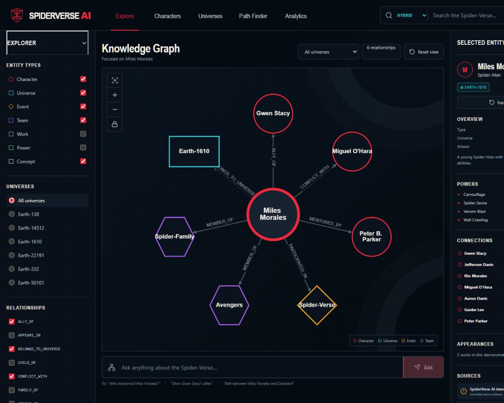
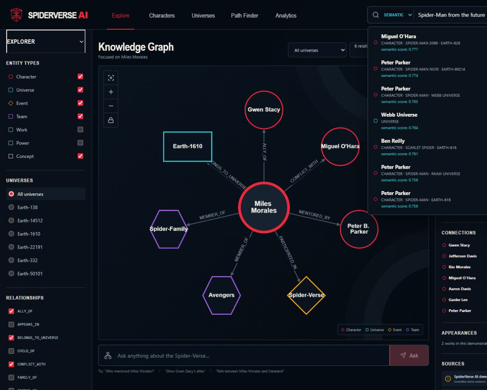
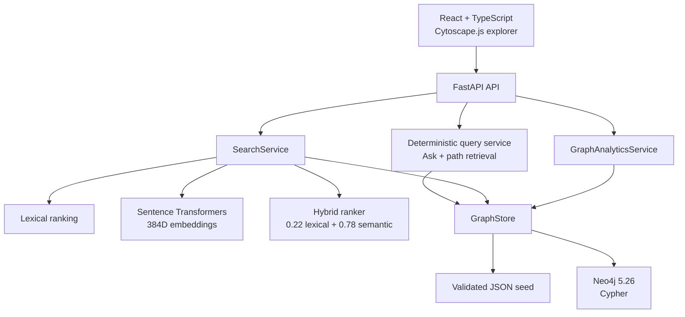
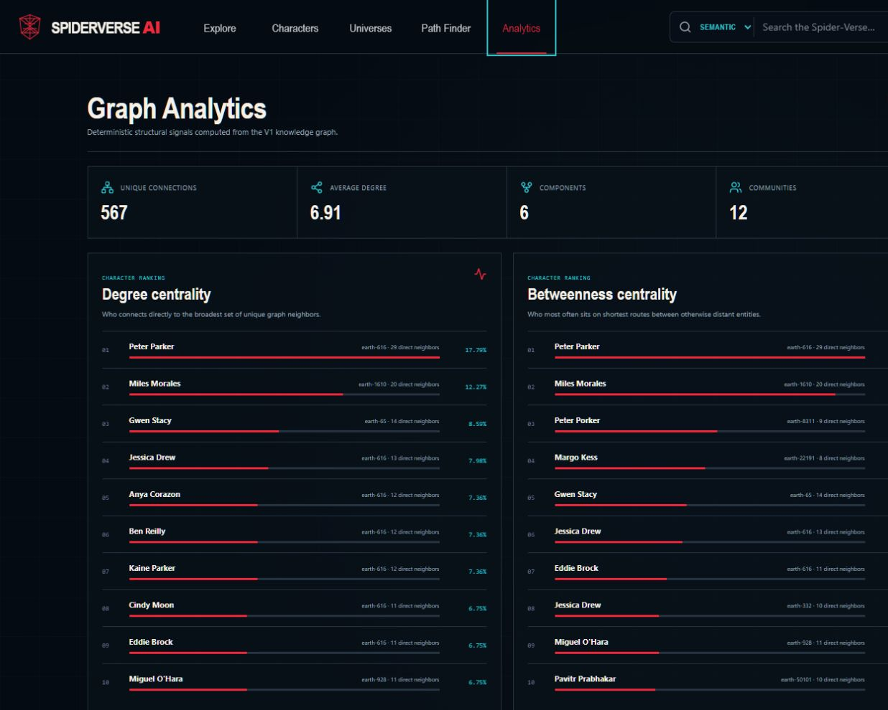
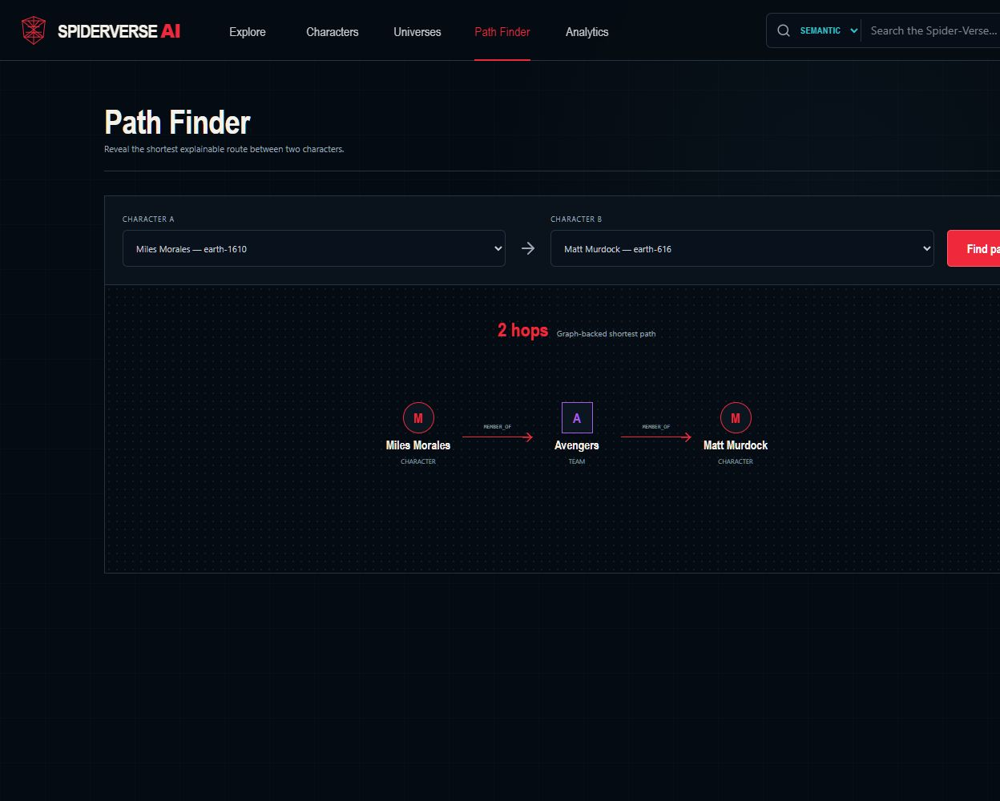
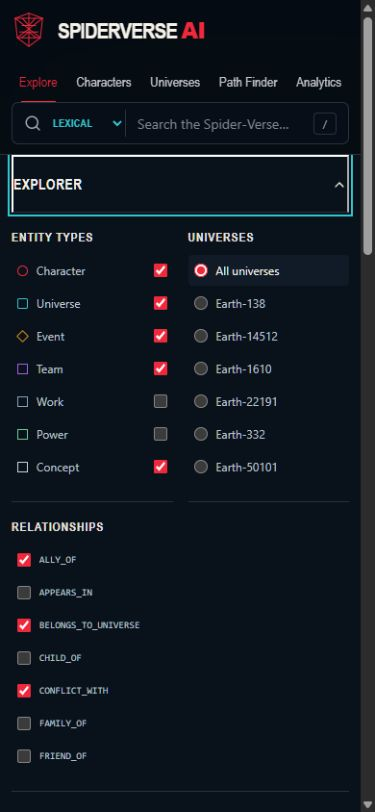

# SpiderVerse AI

**Knowledge Graph & Semantic Search Explorer**

[](https://github.com/amiralfefe/spiderverse-ai/actions/workflows/ci.yml)

Explore a structured Spider-Man multiverse through Neo4j, graph analytics, and hybrid semantic search. Spider-Man is the experimental domain; knowledge representation, retrieval, data quality, and software engineering are the subject of the project.

**164 nodes** · **574 relationships** · **59 characters** · **18 universes** · **50 works**



## Why this project?

Spider-Man provides a compact but demanding domain: many identities, variants, universes, affiliations, works, and potentially contradictory relationships. That makes it useful for demonstrating how a system can model, validate, query, analyze, and retrieve interconnected knowledge without collapsing distinct realities into one record.

The dataset is intentionally a non-canonical demonstration seed. The portfolio value is in the graph architecture and evaluation methodology—not in acting as a Marvel reference wiki.

## What you can explore

### Knowledge Graph Explorer

- Navigate an interactive Cytoscape.js neighborhood.
- Filter entities, universes, and relationship types.
- Inspect character facts, appearances, connections, and edge-level provenance.
- Switch between a deterministic JSON backend and Neo4j/Cypher without changing the API contract.

### Character, universe, and path exploration

- Browse 59 characters while keeping multiverse variants distinct.
- Explore 18 universe nodes and their linked characters.
- Find an explainable shortest path between two characters—for example, Miles Morales to Daredevil.

### Deterministic graph-grounded Ask

`POST /api/ask` resolves supported question patterns and returns retrieved graph facts, a relevant subgraph, and sources. It is deterministic and **does not use an LLM**.

### Graph Analytics

- Degree and betweenness centrality.
- Greedy modularity communities.
- Jaccard structural similarity with shared-neighbor evidence.

### Semantic Search

- Lexical name and alias matching.
- Semantic retrieval with normalized Sentence Transformer embeddings.
- Hybrid ranking with transparent lexical and semantic scores.



## Architecture

The application keeps graph truth, retrieval, analytics, and presentation in separate layers. Both storage backends normalize into the same `GraphStore` contract.



See [the architecture guide](docs/architecture.md) for module boundaries, search flow, and API surfaces.

## Data model

| Entity type | Role |
| --- | --- |
| `Character` | Distinct identities and multiverse variants |
| `Universe` | Reality/designation context |
| `Work` | Comics, films, and games used as evidence |
| `Event` | Narrative events |
| `Team` | Affiliations and memberships |
| `Power` | Character capabilities |
| `Concept` | Shared identity concepts such as Spider-Man |

Representative relationships include `ALLY_OF`, `ENEMY_OF`, `VARIANT_OF`, `MEMBER_OF`, `MENTORED_BY`, `APPEARS_IN`, and `BELONGS_TO_UNIVERSE`. Every relationship has a stable ID and provenance fields for source title, source type, optional URL, and verification state.

## Graph Analytics results

Analytics run on an undirected simple projection of the validated graph. Parallel typed relationships collapse to one structural connection while the original relationship count remains available.

| Metric | Result |
| --- | ---: |
| Nodes | 164 |
| Relationships | 574 |
| Unique connections | 567 |
| Density | 0.042421068382 |
| Connected components | 6 |
| Largest component | 159 nodes |
| Communities | 12 |
| Greedy-modularity score | 0.3604 |

Peter Parker (`peter-616`) is the most central character by both degree and betweenness in this demonstration graph. These scores describe dataset structure, not canon importance.



## Semantic Search benchmark

The Phase 6 benchmark contains 15 versioned queries and measures ranking quality without modifying the graph dataset.

| Mode | Top-1 | Hit@3 | MRR |
| --- | ---: | ---: | ---: |
| Lexical | 40.0% | 40.0% | 0.400 |
| Semantic | 60.0% | 93.3% | 0.733 |
| Hybrid | **73.3%** | **93.3%** | **0.822** |

```text
hybrid_score = 0.22 × lexical_score + 0.78 × semantic_score
```

- Model: `sentence-transformers/multi-qa-MiniLM-L6-cos-v1`
- Immutable revision: `b207367332321f8e44f96e224ef15bc607f4dbf0`
- Embedding dimensions: 384
- Similarity: cosine through normalized dot product

Examples from the benchmark:

- `Spider-Man from the future` → Miguel O'Hara at Semantic rank 1 and Hybrid rank 2.
- `pilot linked to a spider-powered mech` → Peni Parker at rank 1 in Semantic and Hybrid.
- `Myles Moralez` → Miles Morales at rank 1 in Hybrid.

The benchmark also keeps a visible failure: Hobie Brown reaches Semantic rank 3 but falls outside Hybrid's top three. Scores are ranking signals, not calibrated probabilities.

## JSON and Neo4j parity

JSON is the portable local default; Neo4j 5.26 provides the real graph-database and Cypher path. The seed is reproducible, and the same API/search/analytics layers operate over both snapshots.

Phase 6 passed **18/18 deterministic JSON ↔ Neo4j contracts**, covering V1 queries, analytics, normalized search documents, and Lexical/Semantic/Hybrid results.



## Technology stack

| Area | Technologies |
| --- | --- |
| Backend | Python 3.11+, FastAPI, Pydantic |
| Graph | Neo4j 5.26, Cypher, NetworkX |
| Search / NLP | Sentence Transformers, NumPy, cosine similarity, hybrid retrieval |
| Frontend | React 19, TypeScript, Cytoscape.js, Vite |
| Infrastructure | Docker, Docker Compose, GitHub Actions |
| Quality | Pytest, Ruff, ESLint, TypeScript |

## Quick start

### Full stack with Docker Compose

```powershell
git clone https://github.com/amiralfefe/spiderverse-ai.git
cd spiderverse-ai
docker compose up --build
```

Open:

- Frontend: `http://127.0.0.1:5173`
- FastAPI: `http://127.0.0.1:8000`
- Neo4j Browser: `http://127.0.0.1:7474`

Compose starts Neo4j, waits for health, seeds the graph, and launches the backend against Neo4j. The first semantic request downloads the pinned public embedding model into the local user cache; no API key or external inference service is required.

### Local development with the JSON backend

```powershell
python -m venv .venv
.\.venv\Scripts\python -m pip install -e ".[dev,neo4j]"
.\.venv\Scripts\python scripts\generate_dataset.py
.\.venv\Scripts\python scripts\validate_graph.py
.\.venv\Scripts\python -m uvicorn backend.app.main:app --reload --port 8000
```

In another terminal:

```powershell
cd frontend
npm ci
npm run dev
```

`GRAPH_BACKEND=local` is the default. Environment names and safe local Neo4j demonstration values are documented in [.env.example](.env.example).

## Testing and quality

Phase 6 validation recorded:

- 21/21 backend tests passing.
- Ruff, ESLint, TypeScript, and Vite production build passing.
- Docker backend and frontend images building successfully.
- Real Neo4j health and seed checks passing with 164 nodes and 574 relationships.
- 18/18 JSON ↔ Neo4j/Search contracts passing.
- Desktop and mobile browser QA passing with zero application console errors.

Reproduce the main checks:

```powershell
.\.venv\Scripts\python scripts\generate_dataset.py
.\.venv\Scripts\python scripts\validate_graph.py
.\.venv\Scripts\python -m pytest
.\.venv\Scripts\python -m ruff check backend scripts
.\.venv\Scripts\python scripts\benchmark_search.py

cd frontend
npm run lint
.\node_modules\.bin\tsc --noEmit -p tsconfig.app.json
npm run build
```

## Repository structure

| Path | Purpose |
| --- | --- |
| `backend/` | FastAPI routes, graph adapters, query/search/analytics services, tests |
| `frontend/` | React, TypeScript, Cytoscape.js application |
| `data/` | Validated graph, schema, and independent benchmark fixtures |
| `docs/` | Architecture, data model, Cypher reference, roadmap, durable screenshots |
| `reports/` | Executed validation evidence for V1, Phase 5, Phase 6, and portfolio QA |
| `scripts/` | Dataset generation, validation, seeding, parity, and benchmark commands |

## Technical reports

- [V1 stabilization gate](reports/v1_stabilization_gate.md)
- [Phase 5 Graph Analytics](reports/phase5_graph_analytics.md)
- [Phase 6 Semantic Search](reports/phase6_semantic_search.md)
- [Reference Cypher queries](docs/reference-cypher.md)

## Limitations

- The dataset is a non-canonical demonstration seed with 164 entities, not an exhaustive Marvel corpus.
- Semantic quality depends on the descriptions present in the graph and a generic English embedding model.
- The benchmark contains only 15 queries; its metrics are evidence for this fixture, not broad generalization.
- Hybrid search retains a documented Hobie Brown miss.
- The exact in-memory embedding matrix is appropriate for the current corpus and would need reevaluation at larger scale.
- First semantic use requires downloading the pinned public model.
- GraphRAG and LLM generation are **not delivered**.

## Roadmap

- ✅ Knowledge Graph core and reproducible dataset
- ✅ React/Cytoscape graph explorer
- ✅ JSON and Neo4j backends
- ✅ Graph Analytics
- ✅ Semantic Search
- ✅ Hybrid Search and benchmark
- ⏸️ Grounded GraphRAG — future work

Future GraphRAG work would retrieve a bounded subgraph before generation, expose provenance, validate evidence citations, and abstain when graph evidence is insufficient. It is intentionally outside the current product.

## What this project demonstrates

- Knowledge Graph and graph-database modeling
- Data validation, provenance, and reproducibility
- Graph algorithms and structural analysis
- Embeddings, semantic retrieval, and measurable hybrid ranking
- Backend architecture and storage abstraction
- Interactive graph visualization
- Automated testing, Docker workflows, and honest technical reporting


