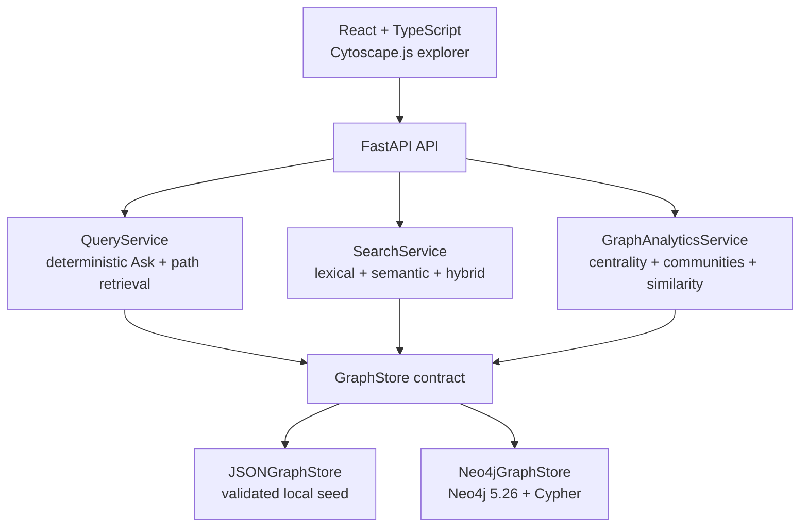
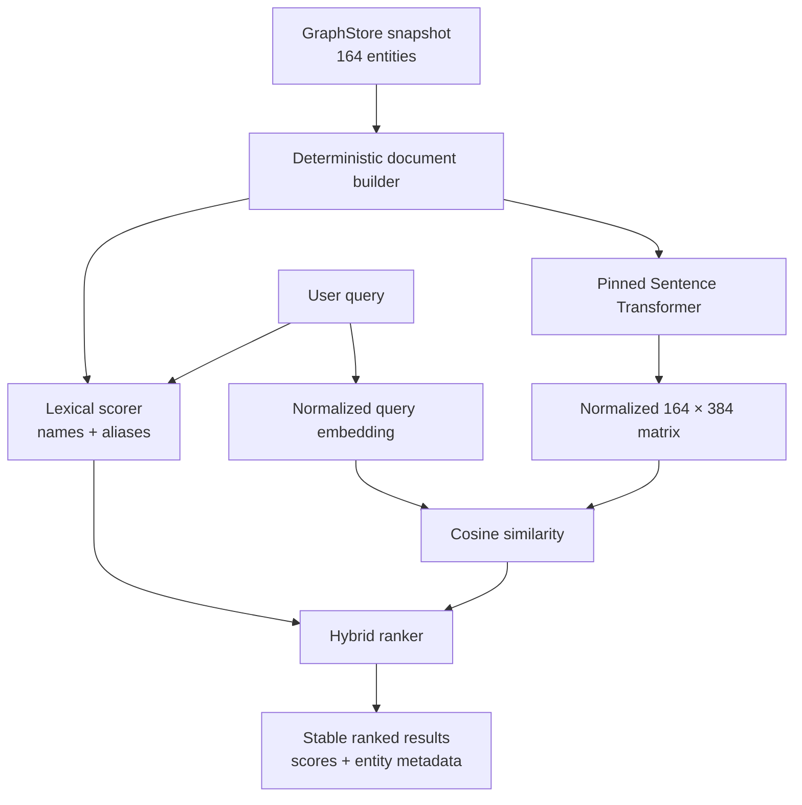

# Architecture

SpiderVerse AI is a graph-first explorer with deterministic query, analytics, and search layers. The Knowledge Graph remains the source of truth; the current application does not include an LLM or GraphRAG pipeline.

## Active system

This documentation-first component view uses Mermaid so the diagram is reviewable with the source and rendered directly by GitHub.

The vertical reading order remains useful on narrow GitHub layouts: presentation, API, domain services, graph abstraction, then storage backends. The surrounding text is the accessible fallback when Mermaid rendering is unavailable.

## Semantic Search pipeline

The model is `sentence-transformers/multi-qa-MiniLM-L6-cos-v1` at immutable revision `b207367332321f8e44f96e224ef15bc607f4dbf0`. The measured Hybrid formula is `0.22 × lexical + 0.78 × semantic`. Embeddings are constructed lazily in memory; no vector database or generated index is versioned.

## Design decisions

- **Graph first:** every answer, score document, analytic projection, and UI assertion originates from the validated graph snapshot.
- **Portable default:** `JSONGraphStore` makes local development and deterministic tests independent of a database service.
- **Real graph database path:** Docker Compose starts Neo4j, waits for health, seeds it, and launches the same API contract against it.
- **Backend-agnostic services:** query, Search, and Analytics services consume the normalized `GraphStore` interface.
- **Deterministic Ask:** `POST /api/ask` performs rule-based entity resolution and graph retrieval; it is not generative AI.
- **Explicit provenance:** relationships retain a source title, source type, optional URL, and verification flag.
- **Variant safety:** character variants remain distinct nodes linked to shared identity concepts.
- **Bounded current scale:** exact NetworkX analytics and an in-memory embedding matrix are appropriate for 164 nodes, with scaling limits documented explicitly.

## Backend modules

| Module | Responsibility |
| --- | --- |
| `config.py` | Environment-backed graph and search configuration |
| `graph_store.py` | JSON/Neo4j loading, normalization, indexes, neighborhoods, details, and paths |
| `query_service.py` | Deterministic graph-grounded question routing |
| `search_service.py` | Documents, lazy embeddings, Lexical/Semantic/Hybrid ranking |
| `analytics_service.py` | NetworkX projection, centralities, communities, and similarity |
| `models.py` | Pydantic API contracts |
| `main.py` | FastAPI validation, dependency wiring, and routes |

## Frontend modules

| Module | Responsibility |
| --- | --- |
| `api.ts` | Typed HTTP transport functions |
| `App.tsx` | View orchestration and initial parallel data loading |
| `AppHeader.tsx` | Navigation and Lexical/Semantic/Hybrid global search |
| `GraphCanvas.tsx` | Lazy Cytoscape.js graph renderer |
| `ExplorerFilters.tsx` | Entity, universe, and relationship filters |
| `EntityInspector.tsx` | Facts, connections, works, and provenance |
| `AskBar.tsx` | Deterministic graph-grounded question flow |
| `views/AnalyticsView.tsx` | Overview, rankings, communities, and similarity |
| `views/` | Character, universe, and path-finder workflows |

## API surface

| Method | Route | Purpose |
| --- | --- | --- |
| `GET` | `/api/health` | Service and adapter status |
| `GET` | `/api/stats` | Counts and evidence split |
| `GET` | `/api/search` | Lexical, Semantic, or Hybrid entity search |
| `GET` | `/api/characters` | Character catalog |
| `GET` | `/api/characters/{id}` | Character facts, relations, works, and sources |
| `GET` | `/api/graph` | Bounded relevant neighborhood |
| `GET` | `/api/universes` | Universe catalog and character counts |
| `GET` | `/api/path` | Narrative shortest path |
| `POST` | `/api/ask` | Deterministic graph-grounded retrieval answer |
| `GET` | `/api/analytics/overview` | Structural graph summary |
| `GET` | `/api/analytics/centrality` | Degree or betweenness ranking |
| `GET` | `/api/analytics/communities` | Greedy-modularity partition |
| `GET` | `/api/analytics/similarity/{character_id}` | Jaccard character similarity |

## Storage parity

JSON and Neo4j expose the same normalized entities and relationships to the service layer. Phase 6 validation passed 18/18 deterministic contracts covering V1 queries, Analytics, search documents, corpus signature, and all benchmark ranking modes.

## Future work

Grounded GraphRAG is planned, not delivered. Any future implementation must retrieve a bounded subgraph before generation, expose evidence provenance, validate cited relationship IDs, and abstain when the graph does not provide enough support.
