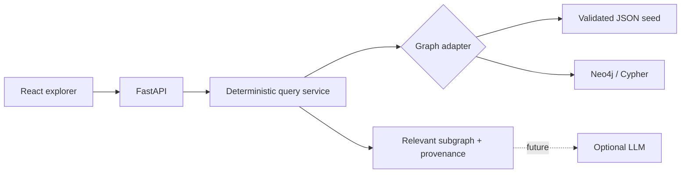

# Architecture

SpiderVerse AI separates graph truth, retrieval, presentation, and future generation.

## Design decisions

- **Graph first:** every answer and UI assertion originates from retrieved nodes and edges.
- **Portable V1:** local JSON is the default adapter. It makes tests and the first launch deterministic.
- **Real Neo4j path:** Docker Compose seeds Neo4j and starts the same API against it. The API contract does not change.
- **No mandatory LLM:** `POST /api/ask` performs entity resolution, relationship filtering, neighborhood retrieval, and shortest-path queries without a model.
- **Explicit provenance:** each edge carries a source title, source type, optional URL, and verification flag.
- **Variant safety:** Peter Parker variants are distinct character nodes linked to an identity concept.

## Backend modules

- `config.py`: environment-backed configuration.
- `graph_store.py`: indexed local store, Neo4j loader, search, neighborhoods, details, and BFS paths.
- `query_service.py`: graph-grounded natural-language routing.
- `main.py`: FastAPI routes and response contracts.

## Frontend modules

- `api.ts`: typed transport functions.
- `App.tsx`: orchestration and parallel initial data loading.
- `GraphCanvas.tsx`: lazily loaded Cytoscape renderer.
- `ExplorerFilters.tsx`: local visual filters.
- `EntityInspector.tsx`: entity facts and source evidence.
- `AskBar.tsx`: deterministic question flow.
- `views/`: character, universe, and path-finder workflows.

## API

| Method | Route | Purpose |
| --- | --- | --- |
| `GET` | `/api/health` | Service and adapter status |
| `GET` | `/api/stats` | Counts and evidence split |
| `GET` | `/api/search` | Alias-aware entity search |
| `GET` | `/api/characters` | Character catalog |
| `GET` | `/api/characters/{id}` | Character facts, relations, works, sources |
| `GET` | `/api/graph` | Bounded relevant neighborhood |
| `GET` | `/api/universes` | Universe catalog and character counts |
| `GET` | `/api/path` | Narrative shortest path |
| `POST` | `/api/ask` | Graph-grounded retrieval answer |
